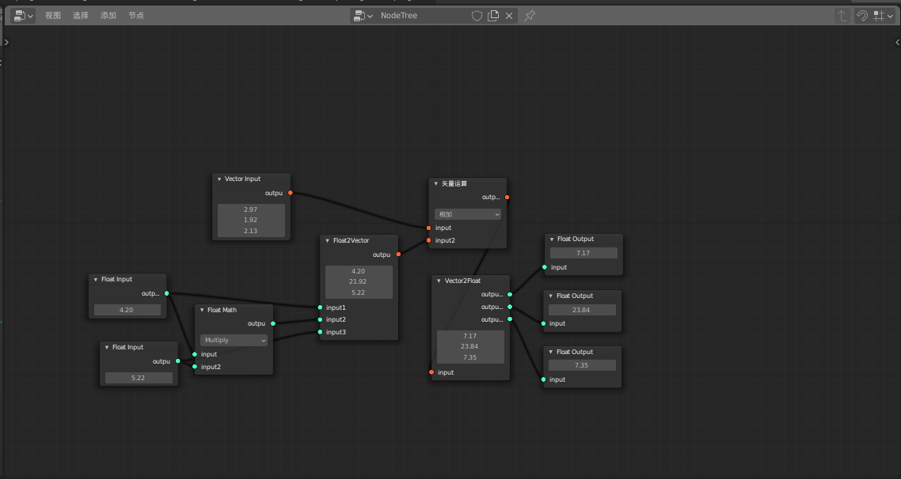

# NodeEditor
Blender的程序化建模插件

## Show

## Current

* 基本框架：自定义的tree-node-socket、tree中的node与socket采用字典查询、基于socket入度的拓扑排序
* 数据传递和处理依靠Tree中的字典，socket传递字典key

## TODO

* 增加更多的节点

* 建模系统、颜色系统

* socket与节点内置值的联动

* socket的节点内值缺省

* 更好的UI和交互

* 节点的UI-update和process-Update

* 节点执行后数据结果的自动刷新问题

* 将入度判断从socket数量的prepare_num改为input-link的num+必须连接的函数判断，link_num为0时执行，会使得没有任何连接的节点执行，prepare函数能否保证不会出问题？检查（已更新，待检查）

* 封装init文件自动加载路径下模块（已完成）

* 让process返回True/False，确定节点是否完成计算，以便决定是否执行transfer

* 隐式mesh-object系列虽然能够独立的产生新obj，但是build之后的所有操作本质还是堆栈式的，需要更改，一个方法是每个节点都产生独立的obj，比如每个节点先进行一个new object(input.name+self.name)，但是这种方式显然不是最佳，并且会产生很多冗余，需要思考更好的方式

* 简单节点的速度比原版本低了一些，但大数据处理速度快了接近一倍。现在传递15万顶点到另一个物体需要1s左右。当然相比原生操作还是慢

  

## Large Change

* 原来socket父类内置有被继承的socket_value，但是由于子类数据类型的变化，父类中的socket_value已经删除，所有的子类必须自己定义socket_value才能满足transfer 传递socket_value的需求（已弃用）
* 原来使用原生list类型用于存储bmesh的点边面数据，但是存在覆盖的问题无法解决，采用转换StringProperty代替（已弃用）
* 底层改变：采用Tree中的字典按照node-name与socket-name储存所有需要处理的值，现在每个节点都需要一个指向tree的引用。但是省去了原socket相关的时空处理。

## Develop Need

fake-bpy-module  
Blender Development  

## Reference

Blender/3.0/scripts/templates_py  
https://gitlab.com/AquaticNightmare/rigging_nodes  
https://github.com/aachman98/Sorcar  
https://github.com/nortikin/sverchok  

## notice

建立object需要mesh，删除object时不会删除mesh,需要清理未使用数据clean  

